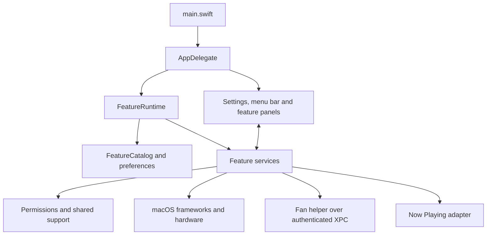

# Vorkraft architecture

Vorkraft is a native Swift macOS utility app, maintained as an independent, full-source fork of [vorssaint-utils](https://github.com/vorssaint/vorssaint-utils). The current build targets Intel (`x86_64`) Macs running macOS 14 or later. It uses AppKit for application lifecycle, windows and system integration, and SwiftUI for much of its interface.

The application is primarily one executable organized by feature, with a separate privileged fan helper and a native Now Playing adapter. Feature services are compiled into the app; they are not separately downloaded plugins. There is no Vorkraft-hosted backend currently.

## Runtime structure



`main.swift` registers defaults, handles diagnostic modes such as `--selftest` and `--sensors`, and starts `NSApplication` with `AppDelegate`. The delegate coordinates launch, settings, menu-bar surfaces and application-level events.

`FeatureCatalog` defines feature availability and hardware support. `FeatureRuntime` connects these definitions to live service bindings. Its closures avoid instantiating unavailable services at launch. Disabling a feature stops its work; an already instantiated singleton may remain inert in memory until restart. Feature availability and individual enabled preferences are distinct.

Services own behavior and expose state to their interfaces, commonly through `ObservableObject`, published properties and shared instances. AppKit windows and service/UI coordination generally run on the main thread; expensive work must use the relevant service's worker mechanisms without publishing UI state from background threads. This is an organizational separation, not strict dependency isolation: some services create their own panels and call shared macOS integration helpers directly.

## Repository map

| Path | Responsibility |
| --- | --- |
| `Sources/Vorkraft/main.swift` | Process entry point and diagnostic modes |
| `Sources/Vorkraft/App/` | Lifecycle, feature runtime and menu-bar management |
| `Sources/Vorkraft/Core/` | Identity, feature catalog, defaults, permissions, localization and common definitions |
| `Sources/Vorkraft/Services/` | Feature behavior: clipboard, recording, monitoring, audio, Dock, window tools and more |
| `Sources/Vorkraft/UI/` | SwiftUI/AppKit settings, onboarding, overlays and feature interfaces |
| `Sources/Vorkraft/Support/` | Supporting application code |
| `Sources/FanControlHelper/` | Privileged fan-control executable |
| `Sources/NowPlayingAdapter/` | Native media integration library |
| `Sources/HIDEventSystem/`, `Sources/VMStatisticsCompat/` | System-library interoperability |
| `Resources/` | Bundle metadata, launch-daemon configuration, localization and assets |
| `Tests/` | Regression suites and upstream-sync fixtures |
| `Tools/` | Signing, packaging, source synchronization and verification |
| `docs/` | Port plan, validation record, troubleshooting and upstream references |

## Native companions and permissions

The fan helper is bundled under `Contents/Library/LaunchServices`, with its launch-daemon plist under `Contents/Library/LaunchDaemons`. Fan-control IPC uses XPC and certificate-pinned peer requirements. The local app and helper must share the expected signing identity; ad-hoc peers are rejected by that authentication path.

The Now Playing adapter is built as `libVorkraftNowPlaying.dylib`. It supports media integration separately from the main Swift executable.

`Core/Permissions.swift` centralizes permission state, including Accessibility and Screen Recording. Individual features gate their operation on the permissions they require. macOS owns these grants; an enabled preference alone does not grant access.

The main bundle identifier is `com.veloraapplabs.vorkraft`, with a separate `.dev` identity for developer builds. Preferences and application storage use Vorkraft identities to avoid sharing the upstream application's state.

## Intel adaptations

- `build.sh` targets `x86_64-apple-macosx14.0` for the app and native companions.
- CPU/GPU monitoring recognizes Intel SMC sensor families. CPU core/package/diode readings are distinguished from auxiliary and GPU sensors, including for fan-curve inputs.
- Unsupported or invalid hardware readings remain unavailable. Older fan controllers without supported control keys remain read-only.
- Recording and export prefer H.264 on Intel; the source retains the upstream codec preference for other architectures.
- Bundle verification inspects every bundled Mach-O for Intel architecture and a compatible deployment target.

Architecture-dependent behavior belongs in explicit platform or capability checks. A successful Intel compile alone does not establish hardware or permission-dependent feature compatibility.

## Panel sizing: Dock Preview

`Services/DockPreview/DockPreviewService.swift` owns hover sessions, pointer handling, window selection and panel geometry. `UI/Switcher/DockPreviewPanelView.swift` renders the cards. Window enumeration and thumbnails reuse the switcher infrastructure.

The service determines panel size and position from the Dock orientation, icon location, window count and screen bounds. Both regular and pinned preview hosting controllers use `sizingOptions = []`, leaving window geometry under AppKit/service control. Do not reintroduce automatic hosting-controller size propagation or forced `layoutSubtreeIfNeeded()` calls at the panel resize sites without checking for layout re-entry.

On the validation Intel Mac, the previous implementation became stuck in AppKit/SwiftUI layout on the main thread. This produced a spinning wait cursor and prevented mouse-leave dismissal. Explicit sizing and removal of forced layout calls resolved the reported hover/dismissal failure, confirmed interactively by the user. This was a UI-layout fix, not proof of an Intel-only defect.

## Build, signing and packaging

`Package.swift` describes the main Swift executable and system-library dependencies. `build.sh` is the complete app-bundle build path: it compiles the executable, fan helper and adapter, generates the icon, copies resources, stamps source provenance and signs the bundle.

```sh
./build.sh
./build/Vorkraft --selftest
./build.sh --test
python3 Tools/verify-port.py --bundle build/stage/Vorkraft.app
./build.sh --install
./Tools/make-dmg.sh
```

The staged app is `build/stage/Vorkraft.app`; installation targets `/Applications/Vorkraft.app`. Disk images are written to `dist/` using the application version.

Local installations use the dedicated `Vorkraft Utils Signing` certificate when configured. Reusing this identity preserves the signing identity macOS associates with permissions across builds. Switching from an early ad-hoc build can leave stale permission entries; see [troubleshooting](docs/VORKRAFT_TROUBLESHOOTING.md).

Local signing is not Developer ID notarization. A Vorkraft notarized release channel is not currently configured. Automatic binary updates are disabled so an upstream release cannot replace the Intel fork. Hosted screenshot/recording sharing and feedback services are also unavailable; local capture and export remain supported.

## Upstream synchronization

`origin` is the private Vorkraft repository; `upstream` is `vorssaint/vorssaint-utils`. The fork retains upstream Git history. Upstream is not a submodule or runtime dependency.

```text
upstream/main → sync/upstream-* → validation → local merge commit
                                            ↓ review and merge
                                      Vorkraft main
```

```sh
./Tools/sync-upstream.sh --check    # Fetch and preview incoming commits
./Tools/sync-upstream.sh            # Merge and validate on a sync branch
./Tools/sync-upstream.sh --install  # Also build/install after successful sync
./Tools/sync-upstream.sh --resume   # Continue after resolving and staging conflicts
```

The command requires a clean checkout for a new sync. It validates the upstream URL, fetches `main`, creates a sync branch, merges, and runs port checks, the build, self-tests, regression tests and bundle verification before committing. It does not push, merge the sync branch into Vorkraft `main`, or publish a release automatically.

`Tools/resolve-upstream-branding.py` resolves eligible name-only source conflicts only when the fork side matches the known branding transformation of the base. Behavioral conflicts remain for review. The Vorkraft README is preserved and the incoming upstream README is stored in `docs/UPSTREAM_README.md`.

Intel and behavior fixes live directly in the fork's source. Git carries them forward where possible; conflicting upstream edits must be reconciled rather than discarded. See [the sync guide](docs/UPSTREAM_SYNC.md).

## Source provenance in About

`upstream-revision.json` stores the integrated upstream branch and full commit SHA. The sync command updates it as part of the merge.

`Tools/stamp-source-revisions.py` embeds the Vorkraft checkout branch/SHA and integrated upstream branch/SHA into the built `Info.plist`. Dirty builds are labeled with uncommitted changes; detached checkouts use available CI branch context or a detached-HEAD label. `AppInfo` reads these values and About displays selectable full SHAs.

These values identify the source included in the installed build. They do not query or claim to represent newer remote commits. For an uncommitted merge build, the Vorkraft SHA is still the pre-merge HEAD and is labeled dirty; a clean build after the merge records the new commit.

## Verification and CI

`.github/workflows/intel.yml` runs on `macos-15-intel` for pushes to `main`, pull requests and manual dispatch. It checks the host and port contracts, exercises sync fixtures, builds, verifies binaries/signatures, runs self-tests and unit tests, and packages a disk image. It does not currently publish releases or upload the installer as an artifact.

`Tools/verify-port.py` checks known branding/identity regressions and bundle architecture, deployment targets and signatures. `Tests/test_upstream_sync.py` uses local fixture repositories to exercise update, conflict and recovery behavior without fetching upstream or building the real app.

The Dock Preview fix passed the local 69,942-check regression suite and preference cleanup, installed-bundle verification and self-tests. The user also confirmed the specific hover/dismissal behavior after installation. Broader interactive and hardware verification remains separate from these automated checks; consult [the validation record](docs/INTEL_VALIDATION.md) for scope and remaining work.

## Maintenance rules

- Preserve upstream attribution and GPL-3.0-or-later licensing.
- Keep Vorkraft bundle, helper, storage, signing and distribution identities separate from upstream.
- Keep UI state and AppKit operations on the main thread; avoid blocking the event loop with long-running work.
- Preserve explicit panel-sizing ownership and cancellation/session checks when modifying hover interfaces.
- Check Intel hardware capability explicitly and represent unsupported features honestly.
- Update this document when process boundaries, build outputs, source synchronization or distribution behavior change.
