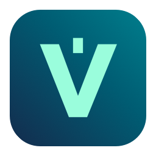

  

# Vorkraft — an independent Vorssaint fork for Intel Macs

Vorkraft brings the [Vorssaint](https://github.com/vorssaint/vorssaint-utils) menu bar toolkit to Intel-based Macs (`x86_64`) running macOS 14 Sonoma or later, including macOS 15 Sequoia. This independent, in-development fork includes system monitoring, window tools, clipboard history, screen recording and other native Mac utilities.

[Download the latest Intel Mac installer](https://github.com/velora-app-labs/vorkraft/releases/latest). Builds are locally signed, not Apple-notarized; see the release notes for installation instructions.

## Support the original developer

Vorkraft is an independent fork of Vorssaint, not an official Vorssaint release. We support the original developer and encourage anyone who finds this app useful to support their work.

[Support Vorssaint on Buy Me a Coffee](https://buymeacoffee.com/vorssaint). Donations through this link go directly to Vorssaint, the original developer, not to Vorkraft or its maintainers.
